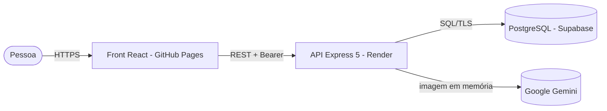
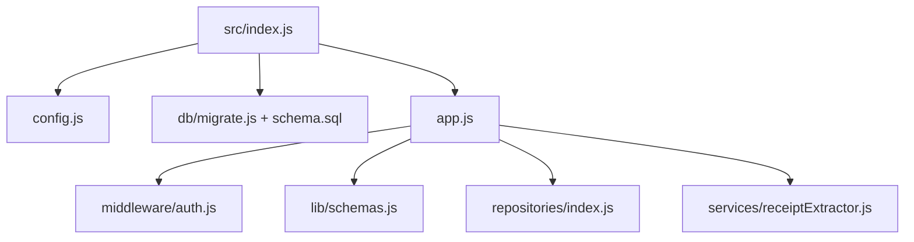

# Arquitetura — controle-financas

## 1. C4

| Contêiner | Tecnologia | Responsabilidade |
|---|---|---|
| Front | React 19, Vite 8, Tailwind 4 | Configuração, envio, catálogo, painel |
| API | Node 20, Express 5, zod, multer (memória) | Autenticação, validação, extração, persistência |
| Banco | PostgreSQL (Supabase) | users, profiles, receipts, products |
| IA | Gemini (SDK `@google/genai`) | Transcrição do cupom para JSON |

### Componentes da API

## 2. Modelo de dados

Mantido o schema original (UUID para users/profiles; SERIAL para receipts). Acréscimos: índices `(profile_id, purchase_date)` e `(receipt_id)`, e índice único de deduplicação `(profile_id, cnpj, purchase_date, total_amount)`. O código `C001` é **derivado** do id (não armazenado).

## 3. Contratos (todas as rotas `/api` exigem `Authorization: Bearer <API_TOKEN>`)

| Método e rota | Sucesso | Erros |
|---|---|---|
| `POST /api/users` | 201 `{ user }` (sem WhatsApp na resposta) | 400 |
| `GET /api/users/:id` | 200 `{ user, profiles }` | 400, 404 |
| `POST /api/profiles` | 201 `{ profile }` | 400 |
| `POST /api/receipts/process` (multipart `receipt_image`, `profile_id`) | 201 `{ receipt, products }` | 400, 404, 409 duplicado, 413, 415, 422 IA ilegível, 429, 502 IA fora |
| `GET /api/receipts?profile_id=` | 200 `{ total, receipts }` | 400 |
| `GET /api/receipts/:id?profile_id=` | 200 `{ receipt, products }` | 400, 404 (inclusive de outro perfil) |
| `GET /api/receipts/dashboard/summary?profile_id=` | 200 `{ summary, top_stores }` | 400 |
| `GET /health` | 200 (público) | — |

## 4. ADRs

- **ADR-001 — Token Bearer de dono único.** App pessoal: um `API_TOKEN` forte, comparado em tempo constante, fecha o acesso sem criar um sistema de contas. O token fica no `localStorage` do navegador (risco aceito: exige que o front não tenha XSS; o React escapa por padrão). Próximo passo: Supabase Auth com RLS.
- **ADR-002 — Detalhe exige `profile_id` e casa com o dono.** Elimina o IDOR por id sequencial.
- **ADR-003 — Validar a saída da IA com zod.** Modelo de linguagem é entrada não confiável: tipos, faixas e tamanho de lista são verificados antes do banco.
- **ADR-004 — Upload em memória.** `multer.memoryStorage()` com limite de 5 MB e tipos de imagem; nada é gravado em disco.
- **ADR-005 — Modelo configurável.** `GEMINI_MODEL` permite trocar o modelo sem mudar código.

## 5. Fora do escopo

Insights/variação de preço por produto, gráficos de série temporal, Supabase Auth/RLS, exportação CSV.
